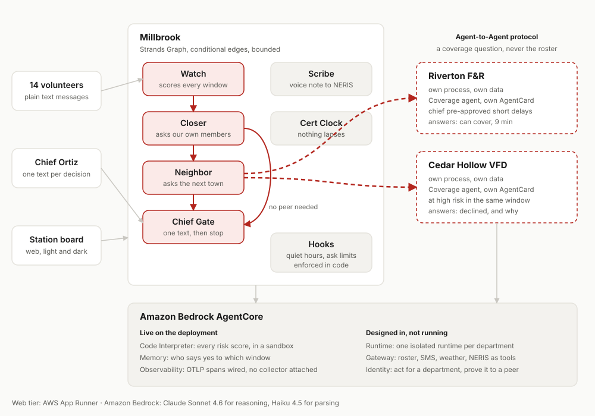

# Turnout

**Every other tool tells the chief who is coming. Turnout makes sure someone is.**

A background agent for volunteer fire and EMS departments. It finds the hours when nobody can
respond, fills them by asking the right people and the right neighbours, and interrupts the chief
only for the one decision that needs a human.

Built with the [Strands Agents SDK](https://strandsagents.com/) on
[Amazon Bedrock](https://docs.aws.amazon.com/bedrock/), deployed on AWS App Runner.
Every risk score is computed inside [Amazon Bedrock AgentCore](https://docs.aws.amazon.com/bedrock-agentcore/)
Code Interpreter, and response history lives in AgentCore Memory.
Submitted to the AWS Agents for Humans Hackathon, **Good Neighbor Agents** track.

---

## The problem

The station is not empty. It is empty at 2pm on a Tuesday.

Two thirds of America's firefighters are volunteers, and most rural ambulances are staffed by
volunteers too. They have day jobs, often 30 miles from the station. The roster looks fine on paper
and is empty in the middle of the workday, and the chief finds out when the tone drops and nobody
answers.

| Fact | Source |
|---|---|
| Volunteer firefighter numbers hit a 35 year low while call volume more than tripled | [NFPA Journal, Feb 2026](https://www.nfpa.org/news-blogs-and-articles/nfpa-journal/2026/02/11/volunteer-fire-service-crisis) |
| 4.5 million Americans live more than 25 minutes from an ambulance | [Maine Rural Health Research Center, 2023](https://www.ruralhealthresearch.org/publications/1596) |
| Median rural EMS response is 13 minutes against 6 in cities, across 1.8 million runs | [Mell et al., JAMA Surgery, 2017](https://jamanetwork.com/journals/jamasurgery/fullarticle/2643992) |
| Cardiac arrest survival falls 5 to 12 percent per minute of delay | [JAHA, 2020](https://www.ahajournals.org/doi/10.1161/JAHA.120.017048) |
| Volunteers answer 17 to 47 percent of alerts; a model using their own history predicted who responds at 79 percent accuracy | [Predictive Dispatch of Volunteer First Responders, 2023](https://www.ncbi.nlm.nih.gov/pmc/articles/PMC10716760/) |
| Mutual aid lands unevenly; some departments become hubs and burn out | [CAFDA](https://cafda.net/the-greatest-threat-facing-the-volunteer-fire-service-is-math-not-recruitment-this-is-a-must-read-article/) |
| NERIS replaced NFIRS on 1 Feb 2026, so every department moved to a new report this year | [US Fire Administration](https://www.usfa.fema.gov/nfirs/sunset/) |

## What it does

1. **Roll call by text.** Each morning, one message per volunteer: "Around Thu 8a to 5p? Y or N."
   No app to install. It reads `till 2`, `morning only` and `sorry, can't` just fine, and honours
   `STOP` immediately.
2. **It sees the hole before it hurts.** A deterministic risk engine scores every window that cannot
   make a crew, using the department's own 12 months of call history, per-member response
   probabilities, and live weather alerts.
3. **It closes what it can itself,** asking only the members most likely to say yes for that
   specific window, inside their quiet hours and a weekly ask limit.
4. **Then it asks the next town.** Each department runs its own agent. Millbrook's agent asks
   Riverton's and Cedar Hollow's agents directly over the Agent-to-Agent protocol, and ranks the
   offers by delay, mutual aid balance, and the neighbour's own risk.
5. **One text to the chief.** Windows that share an answer are batched into a single message.
   Nothing is confirmed with a neighbour until she replies.
6. **After the call, the report writes itself.** A voice debrief becomes a draft NERIS report with
   the uncertain fields flagged rather than guessed.

## Architecture



Inside a department the work is a **Strands `Graph`** with conditional edges: Watch, then Closer,
then Neighbor, then Chief Gate, with each edge reading the store rather than the previous node's
prose. Scribe and Cert Clock run as separate scheduled jobs. Between departments it is **A2A**: each
department publishes an AgentCard and answers coverage questions about itself, and nothing else.

### Strands features used, and why

| Feature | Where | Why this one |
|---|---|---|
| `GraphBuilder` with conditional edges, `set_max_node_executions` | The coverage pass | A safety workflow must be deterministic and auditable. A Swarm would let agents hand off freely, which is wrong here. |
| Hooks (`BeforeToolCallEvent`) | Every agent | Quiet hours and the weekly ask limit are enforced in code. A policy about not bothering volunteers should not be something a prompt can talk its way around. |
| `A2AServer` plus AgentCard skills | One per department | Departments are separate organizations. A2A is the protocol built for exactly that boundary. |
| Structured output (Pydantic) | Reply parsing, NERIS drafts, offers | Downstream code never parses prose. |
| Agents as tools | Scribe, Cert Clock | Self-contained jobs with clear inputs and outputs. |

### AgentCore services, and why

**Code Interpreter and Memory are live on the deployment. The rest are designed in.** Any gap card
names where its numbers were computed, so this is checkable rather than a claim.

| Service | Status | Use here |
|---|---|
| Code Interpreter | **live** | Every risk score runs there, using `engine/kernel.py`, the same dependency free file the local path imports. Identical results, and the card says which ran. |
| Memory | **live** | One memory per department holding response history. `python -m turnout.agentcore.provision` creates them, because provisioning takes minutes and a chief should not wait. |
| Runtime | designed | One isolated runtime per department. The web tier is App Runner today. |

| Gateway | designed | Roster, SMS, weather and NERIS as tools, with credentials out of agent code. |
| Identity | designed | Scoped credentials to act for a department, and to prove identity to a peer. |

| Observability | designed | The Trace tab reads the agents' own event stream today. |

## Run it

Needs Python 3.12 and AWS credentials with Amazon Bedrock access in `us-east-1`.

```bash
git clone <repo> && cd turnout
uv venv && uv pip install -e ".[dev]"
python -m turnout.data.generate                     # writes the synthetic scenario
uvicorn turnout.api.app:app --port 8000
```

Open <http://localhost:8000>. Press the steps in order to play the week.

To run the departments as genuinely separate A2A servers:

```bash
python -m turnout.a2a.server --dept riverton --port 9002 &
python -m turnout.a2a.server --dept cedar    --port 9003 &
```

Model ids are configuration, never hard-coded. See `src/turnout/config.py`; override with
`TURNOUT_REASONING_MODEL` and `TURNOUT_FAST_MODEL`.

## Tests

```bash
pytest -q          # 128 tests
```

The suite includes real A2A over HTTP between separate servers, including a test that asks a peer
for its roster and asserts no roster comes back.

| Area | What is covered |
|---|---|
| Risk engine | Hand-computed fixtures, monotonicity (more members never raises risk, a hazard never lowers it), every level boundary |
| Crew feasibility | Exact bipartite matching, including one person who is both driver and firefighter not filling two slots |
| Reply parsing | 82 phrasings of yes, no, partial windows, STOP, HELP and chief decisions, measured in docs/EVAL.md |
| Message templates | Every template is length-checked so no text splits across two messages |
| Policy hooks | Quiet hours and weekly ask limits provably block a send |
| A2A | AgentCard discovery, an offer, a decline with its reason, roster isolation, and a full negotiation |
| Coverage flow | Gap detected, closed by a member, closed by a neighbour, batched into one interrupt |
| Onboarding | Group text and spreadsheet pastes, phone formats, duplicates, and that a pasted roster can actually make a crew |
| Scoring endpoint | Unknown roles and weather refused with the list it knows, and more people never raising the score |

## Bring your own data

This is not only a scripted demo.

- **`/try.html`** points the risk engine at your own department. Say who could actually turn out on a
  given afternoon, what your minimum crew is, how many calls a day you run, and what the weather is
  doing, and it returns the same verdict the demo uses, with every number behind it.
- **`/start.html`** takes a paste of whatever roster you already have, in any format, and reads names,
  numbers and roles out of it.
- Or from your own code:

```bash
curl -X POST <host>/api/risk/score -H "content-type: application/json" -d '{
  "window_start": "2026-09-10T10:00", "hours": 4,
  "available": [{"roles": ["firefighter"], "responds": 0.45}],
  "min_crew": {"driver_operator": 1, "firefighter": 2},
  "calls_per_day": 2.5, "weather": "ice storm warning"
}'
```

Nothing is stored, and nobody is texted.

## Checks that run, not claims

```bash
pytest -q                                    # the suite
ruff check src tests tools                   # lint
python tools/check_copy.py                   # no emoji, no em or en dashes, anywhere
uvicorn turnout.api.app:app --port 8000 &
python tools/a11y_audit.py --base http://127.0.0.1:8000     # axe-core, layout and target sizes
```

`tools/a11y_audit.py` loads every page in both themes at 390, 768 and 1280 pixels wide, which is 30
page renders, and fails the build on any WCAG 2.2 A or AA violation, any page that scrolls sideways,
any control under its target size, or any console error. It is currently clean. Both checks run in
GitHub Actions on every push, in `.github/workflows/ci.yml`.

## Deploy

The live service is AWS App Runner, one long running container, because the demo holds shared
in-memory state: with Lambda two judges pressing the same step would land on different instances
holding different days.

```bash
python -m deploy.roles                       # the ECR access role and a Bedrock instance role
aws ecr create-repository --repository-name turnout --region us-east-1
aws ecr get-login-password --region us-east-1   | docker login --username AWS --password-stdin <account>.dkr.ecr.us-east-1.amazonaws.com
docker build -t turnout . && docker tag turnout <account>.dkr.ecr.us-east-1.amazonaws.com/turnout:latest
docker push <account>.dkr.ecr.us-east-1.amazonaws.com/turnout:latest
python -m deploy.apprunner                   # creates or updates the service, then waits
```

`deploy/apprunner.py` pins the service to the image **digest** currently in ECR rather than to the
`:latest` tag. Pushing a new image to the same tag does not change App Runner's image identifier, so
it treats the update as a no-op and quietly keeps serving the old build. That bug cost an afternoon,
which is why the fix is in the script and this paragraph is in the README.

The instance role is scoped to `InvokeModel` on the specific models and inference profiles this app
uses, not a wildcard, because a demo credential that can call anything is a bad example to ship.

The container runs three processes: the web API, and Riverton and Cedar Hollow as separate A2A
servers on 9002 and 9003. See `docker-entrypoint.sh`.

## For judges

Start at the deployed URL, or `http://localhost:8000` after the two commands above.

- **Play the week** on the demo page. Five steps, no login, or press Play the rest of the week and
  watch it run itself.
- **Station board** shows each gap with its explanation. Expand "Show the numbers behind this" for
  the actual inputs and the formula.
- **Phones** shows both sides of every text. The reply buttons go through the same inbound path a
  real message would.
- **Network** shows the A2A exchange and the mutual aid ledger.
- **Agent trace** is every step the agents took, including the decision *not* to interrupt.
- **[What the agent asks of you](web/crew.html)** (`/crew.html`) is the other side of the board.
  For every member: how many times the agent has asked this week against the cap, the hours it will
  not text them, every message it sent including the ones it held until quiet hours ended, and the
  response history behind the two people it chose. An agent that asks unpaid people for hours of
  their life should be answerable to them, so this page exists and the same record is at
  `GET /api/crew`.

Everything is synthetic. Millbrook, Riverton and Cedar Hollow are fictional; the members, phone
numbers, twelve months of call history and the incident are generated by
`src/turnout/data/generate.py`. The ice storm warning is injected by the scenario file so the same
story plays every time; the live weather tool calls the public National Weather Service API.

## Safety and limits

- It never pages anyone to an incident. Dispatch stays with dispatch.
- It never commits mutual aid without a chief. A neighbour's agent can auto-approve only inside a
  rule that neighbour's chief set.
- It never texts a volunteer during their quiet hours or past the weekly limit. Enforced by a hook.
- It never submits a NERIS report on its own.
- It never guesses a number it can show. Where history is thin the explanation says the estimate
  leans on a national pattern.
- It stores no location and no health data.

## Honest notes

- **The risk scale is a judgement call.** A four hour window in a small department expects well
  under one call, so the raw arrival rate alone would never read as critical. The engine multiplies
  by a scale constant of 3.0, chosen so that roughly half of one expected unanswered time-critical
  call scores as critical. That constant is a modelling choice, documented at the top of
  `engine/risk.py`, not something derived from data.
- **NERIS submission is mocked.** The real system needs department credentials. The draft, the
  uncertainty flagging and the review step are real; the submit call records the payload.
- **SMS is simulated in the demo** so the same story plays every time. The AWS End User Messaging
  path is implemented in `channels/sms.py` behind the same interface.

## Licence

MIT. See [LICENSE](LICENSE).
