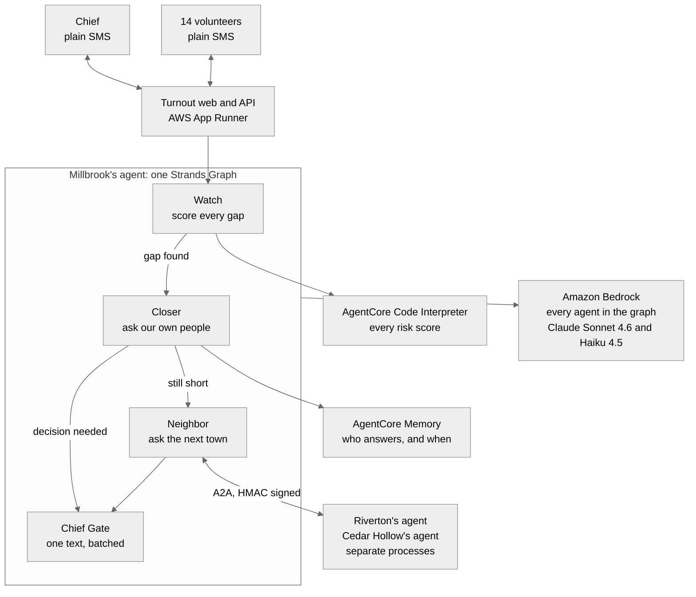

# Turnout

**A background agent that keeps a volunteer fire department staffed.** It polls the roster by plain
text message, scores every hour nobody can answer a call, negotiates with the neighbouring
departments' own agents, and interrupts the chief exactly once.

Every other tool tells the chief who is coming. Turnout makes sure someone is.

| | |
|---|---|
| **Live** | <https://zjrrw6wpxj.us-east-1.awsapprunner.com> (no login, press the steps in order) |
| **Track** | AWS Agents for Humans Hackathon, Good Neighbor Agents |
| **Built with** | [Strands Agents SDK](https://strandsagents.com/), [Amazon Bedrock](https://docs.aws.amazon.com/bedrock/), [Bedrock AgentCore](https://docs.aws.amazon.com/bedrock-agentcore/), AWS App Runner |
| **Measured** | 14 of 14 adversarial cases refused, 0 of 6 legitimate ones wrongly refused. 82 reply phrasings read at 100 percent with no model call. [docs/EVAL.md](docs/EVAL.md), rerun in CI on every push |

---

## The problem

The station is not empty. It is empty at 2pm on a Tuesday.

Two thirds of America's firefighters are volunteers, and most rural ambulances are staffed by
volunteers too. They have day jobs, often 30 miles away. The roster looks fine on paper and is empty
in the middle of the workday, and the chief finds out when the tone drops and nobody answers.

| What is true | Source |
|---|---|
| Volunteer firefighter numbers hit a 35 year low while call volume more than tripled | [1] |
| 4.5 million Americans live more than 25 minutes from an ambulance | [2] |
| Median rural EMS response is 13 minutes against 6 in cities, across 1.8 million runs | [3] |
| Cardiac arrest survival falls 5 to 12 percent for every minute of delay | [4] |
| Volunteers answer 17 to 47 percent of alerts, and a model built on their own history predicted who responds at 79 percent accuracy | [5] |
| Mutual aid lands unevenly, so some departments become hubs and burn out | [6] |
| NERIS replaced NFIRS on 1 February 2026, so every department moved to a new report this year | [7] |

Full citations are in [References](#references).

Source [5] is the one the product is built on. Availability is not turnout. A member saying they are
free is not a promise to answer, so four available people can be a legal crew on paper and no crew at
all at two on a Tuesday. Turnout scores the probability, not the headcount.

## What it does

1. **Roll call by text.** One message per volunteer each morning: "Around Thu 8a to 5p? Y or N." No
   app to install. It reads `till 2`, `morning only` and `sorry, can't` correctly, and honours `STOP`
   immediately.
2. **It sees the hole before it hurts.** A deterministic engine scores every window that cannot make
   a crew, using the department's own 12 months of call history, per member response probabilities,
   and live National Weather Service alerts.
3. **It closes what it can itself,** asking only the members most likely to say yes for that specific
   window, inside their quiet hours and under a weekly ask limit.
4. **Then it asks the next town.** Each department runs its own agent. Millbrook's agent asks
   Riverton's and Cedar Hollow's agents directly over the Agent to Agent protocol, and ranks the
   offers by delay, mutual aid balance, and the neighbour's own risk.
5. **One text to the chief.** Windows that share an answer are batched into a single message. Nothing
   is confirmed with a neighbour until she replies.
6. **After the call, the report writes itself.** A voice debrief becomes a draft NERIS report with the
   uncertain fields flagged rather than guessed.

## How it is built



Two boundaries, two protocols. **Inside** a department the work is a Strands `Graph` with conditional
edges, because a safety workflow has to be deterministic and auditable, and each edge reads the shared
store rather than the previous node's prose. **Between** departments it is **A2A**, because
departments are separate organisations: each publishes an AgentCard and answers coverage questions
about itself, and nothing else. Scribe and Cert Clock run as separate scheduled agents.

The risk score itself is not a model output. It is plain Python in `engine/kernel.py`, with the model
deciding what to do about the number rather than producing it.

### Strands features, and why each one

| Feature | Where | Why this one |
|---|---|---|
| `GraphBuilder`, conditional edges, `set_max_node_executions` | The coverage pass | A Swarm would let agents hand off freely. Wrong for a safety workflow that has to be explainable afterwards. |
| Hooks (`BeforeToolCallEvent`) | Every agent | Quiet hours and the weekly ask limit are enforced in code. A policy about not bothering unpaid volunteers should not be something a prompt can talk its way around. |
| `A2AServer` and AgentCard skills | One per department | The protocol built for exactly this organisational boundary. |
| Signed requests across that boundary | `a2a/identity.py` | Riverton commits an apparatus on the strength of a request. It has to be able to tell that Millbrook sent it. |
| Structured output (Pydantic) | Reply parsing, NERIS drafts, offers | Downstream code never parses prose. |
| Agents as tools | Scribe, Cert Clock | Self contained jobs, clear inputs and outputs. |
| `strands.telemetry` | `observability.py` | Our own trace format stops at the edge of this process. OTLP spans do not. |

Three surfaces were deliberately left alone: `strands.session`, `strands.interrupt` and
`strands.tools.mcp`. [docs/STRANDS_SURFACES.md](docs/STRANDS_SURFACES.md) is the full inventory with a
reason for each. The interesting one is `Interrupt`: it pauses an in process run and resumes it with
an answer, and this agent escalates to a chief who may be asleep. The run ends and her reply is
applied hours later. Asynchronous escalation is the design, not a gap in it.

### Which AWS services are actually running

Every gap card on screen names where its numbers were computed, so this table is checkable rather
than a claim.

| Service | Status | What it does here |
|---|---|---|
| Bedrock (Sonnet 4.6, Haiku 4.5) | **live** | Reasoning and reply parsing. Model ids are configuration, never hard coded. |
| AgentCore Code Interpreter | **live** | Every risk score runs there, using the same dependency free `engine/kernel.py` the local path imports. Identical results, and the gap card says which one ran. |
| AgentCore Memory | **live** | One memory per department. Every answer a member gives is written as it arrives, and `/crew.html` reports how many landed rather than claiming it. |
| AgentCore Observability | **code path live, no collector attached** | `observability.py` exports OTLP spans, off unless `OTEL_EXPORTER_OTLP_ENDPOINT` is set. `/api/health` reports which state it is in, so the page cannot claim tracing that is not running. |
| AgentCore Runtime | designed | One isolated runtime per department. The web tier is App Runner today. |
| AgentCore Gateway | designed | Roster, SMS, weather and NERIS as managed tools. |
| AgentCore Identity | designed | Scoped credentials to act for a department. The HMAC signing described below is the smaller, honest version of this. |
| App Runner | **live** | One long running container, because the demo holds shared in memory state. On Lambda, two judges pressing the same step would land on different instances holding different days. |

## Run it locally

Needs Python 3.12 and AWS credentials with Amazon Bedrock access in `us-east-1`.

```bash
git clone https://github.com/usv240/turnout && cd turnout
uv venv && uv pip install -e ".[dev]"
python -m turnout.data.generate          # writes the synthetic scenario
uvicorn turnout.api.app:app --port 8000
```

Open <http://localhost:8000> and press the steps in order to play the week.

To run the neighbouring departments as genuinely separate A2A servers rather than in process:

```bash
python -m turnout.a2a.server --dept riverton --port 9002 &
python -m turnout.a2a.server --dept cedar    --port 9003 &
```

Override models with `TURNOUT_REASONING_MODEL` and `TURNOUT_FAST_MODEL`. See `src/turnout/config.py`.

## Tests and checks

Everything below runs in GitHub Actions on every push. See `.github/workflows/ci.yml`.

```bash
pytest -q                         # 178 tests
pytest -q -m "not aws"            # 169, the 9 AWS marked ones need live credentials
ruff check src tests tools        # lint
python tools/check_copy.py        # house style: no emoji, no em or en dashes, anywhere

python -m evals.refusal_eval      # 14 adversarial cases, 6 legitimate controls
python -m evals.baseline_eval     # against the obvious alternative
python -m evals.wild_eval         # the parser against a corpus we did not write

uvicorn turnout.api.app:app --port 8000 &
python tools/a11y_audit.py --base http://127.0.0.1:8000           # 30 page renders
python tools/a11y_audit.py --base http://127.0.0.1:8000 --play    # 54, with the demo played
python tools/dry_run.py turnout http://127.0.0.1:8000             # every page, step and tab
python tools/zoom_audit.py http://127.0.0.1:8000 /,/app.html,/try.html,/start.html,/crew.html
                                                                  # 200 and 400 percent zoom
```

The accessibility audit loads every page in both themes at 390, 768 and 1280 pixels wide, and fails
the build on any WCAG 2.2 A or AA violation, any page that scrolls sideways, any control under its
target size, or any console error. It runs twice, because an empty page audits about a fifth of the
app: the second pass plays the demo first and then checks every tab in the populated app. Four real
defects lived in that half and none of them could be seen from an empty page.

| Area | What the suite covers |
|---|---|
| Risk engine | Hand computed fixtures, monotonicity (more members never raises risk, a hazard never lowers it), every level boundary |
| Crew feasibility | Exact bipartite matching, including that one person who is both driver and firefighter does not fill two slots |
| Reply parsing | 82 phrasings of yes, no, partial windows, STOP, HELP and chief decisions, published in docs/EVAL.md |
| Message templates | Every template length checked, so no text splits across two messages |
| Policy hooks | Quiet hours and weekly ask limits provably block a send |
| A2A | AgentCard discovery, an offer, a decline with its reason, roster isolation, and a full negotiation over real HTTP between separate servers |
| Mutual aid identity | An unsigned request, one signed by a different department, and one edited after signing are each refused with a reason |
| Coverage flow | Gap detected, closed by a member, closed by a neighbour, batched into one interrupt |
| Onboarding | Group text and spreadsheet pastes, phone formats, duplicates, and that a pasted roster can actually make a crew |

### Who is allowed to ask

A coverage request crosses an organisational boundary, and answering it costs the receiving
department an apparatus and a place in the ledger. So every request and every confirmation carries an
HMAC over its own contents, checked before the receiving agent evaluates anything. Unsigned, signed by
a department we hold no agreement with, or signed by one department while claiming to come from
another, and it is refused with the reason rather than answered.

Departments already sign a paper mutual aid agreement naming the two parties before they roll for each
other, so a key held by both mirrors how this works on the ground rather than inventing something
cloud shaped. Set `TURNOUT_A2A_KEYS="millbrook:<key>,riverton:<key>"` to supply real keys. With
nothing set, a published constant derives a demo keyring so the local run and the tests work without
setup. That mode is labelled `demo_key` in the trace and is not pretending to be a secret.

## Try it with your own data

This is not only a scripted demo.

- **`/try.html`** points the risk engine at your own department. Say who could actually turn out on a
  given afternoon, what your minimum crew is, how many calls a day you run, and what the weather is
  doing. It returns the same verdict the demo uses, with every number behind it.
- **`/start.html`** takes a paste of whatever roster you already have, in any format, and reads names,
  numbers and roles out of it.
- **The API** is on the landing page under API, with a button that mints you a key and another that
  calls every read endpoint in front of you. Read endpoints also accept the public sandbox key
  `turnout-sandbox-2026`, or no key at all.

```bash
curl -X POST https://zjrrw6wpxj.us-east-1.awsapprunner.com/api/risk/score \
  -H "content-type: application/json" -d '{
  "window_start": "2026-09-10T10:00", "hours": 4,
  "available": [{"roles": ["firefighter"], "responds": 0.45}],
  "min_crew": {"driver_operator": 1, "firefighter": 2},
  "calls_per_day": 2.5, "weather": "ice storm warning"
}'
```

Nothing is stored, and nobody is texted.

## What to look at

- **Play the week.** Five steps, no login, or press "Play the rest of the week" and watch it run.
- **Station board** shows each gap with its explanation. Expand "Show the numbers behind this" for the
  actual inputs and the formula.
- **Phones** shows both sides of every text. The reply buttons go through the same inbound path a real
  message would.
- **Network** shows the A2A exchange and the mutual aid ledger.
- **Agent trace** is every step the agents took, including the decision *not* to interrupt.
- **`/crew.html`** is the other side of the board. For every member: how many times the agent has asked
  this week against the cap, the hours it will not text them, every message it sent including the ones
  it held until quiet hours ended, and the response history behind the two people it chose. An agent
  that asks unpaid people for hours of their life should be answerable to them, so this page exists and
  the same record is at `GET /api/crew`.

## What it will not do

- It never pages anyone to an incident. Dispatch stays with dispatch.
- It never commits mutual aid without a chief. A neighbour's agent can auto approve only inside a rule
  that neighbour's chief set.
- It never texts a volunteer during their quiet hours or past the weekly limit. Enforced by a hook, in
  code, not by a prompt.
- It never submits a NERIS report on its own.
- It never guesses a number it can show. Where history is thin, the explanation says the estimate leans
  on a national pattern.
- It stores no location and no health data.

## Honest notes

- **Everything is synthetic.** Millbrook, Riverton and Cedar Hollow are fictional. The members, phone
  numbers, twelve months of call history and the incident are generated by
  `src/turnout/data/generate.py`. The ice storm warning is injected by the scenario file so the same
  story plays every time. The live weather tool calls the real National Weather Service API.
- **The risk scale is a judgement call.** A four hour window in a small department expects well under
  one call, so the raw arrival rate alone would never read as critical. The engine multiplies by a
  scale constant of 3.0, chosen so that roughly half of one expected unanswered time critical call
  scores as critical. That constant is a modelling choice, documented at the top of `engine/risk.py`,
  not something derived from data.
- **It drafts a NERIS report and then stops.** Submitting one needs credentials issued to a named
  officer, and that is exactly where a person should be reading what is about to enter a federal
  incident record. The draft, the uncertainty flagging and the chief's review are real and measured.
  The submit call records the payload it would have sent. The stopping is the product, not a gap in it.
- **Messages run against a simulated carrier,** so the demo plays the same way every time. Both
  channels sit behind one interface in `channels/sms.py`, and the AWS End User Messaging path is the
  same code below it. Either way a message passes the same policy hooks, the same quiet hours logic and
  the same 160 character segment check. What is simulated is the carrier, not the decision to send.
- **`tools/check_copy.py` holds this repo to one house rule: no emoji, no em or en dashes.** For a long
  time it only checked text we wrote, not the text a model writes at request time.
  `src/turnout/house.py` closes that: model output passes through `plain()` on its way to a screen or a
  phone. Punctuation only, nothing truncated or reworded, and idempotent so it is safe to apply twice.

## Deploy

```bash
python -m deploy.roles                       # the ECR access role and a scoped Bedrock instance role
aws ecr create-repository --repository-name turnout --region us-east-1
aws ecr get-login-password --region us-east-1 | docker login --username AWS --password-stdin <account>.dkr.ecr.us-east-1.amazonaws.com
docker build -t turnout . && docker tag turnout <account>.dkr.ecr.us-east-1.amazonaws.com/turnout:latest
docker push <account>.dkr.ecr.us-east-1.amazonaws.com/turnout:latest
python -m deploy.apprunner                   # creates or updates the service, then waits
```

`deploy/apprunner.py` pins the service to the image **digest** currently in ECR rather than to the
`:latest` tag. Pushing a new image to the same tag does not change App Runner's image identifier, so it
treats the update as a no op and quietly keeps serving the old build. That bug cost an afternoon, which
is why the fix is in the script and this paragraph is in the README.

The instance role is scoped to `InvokeModel` on the specific models and inference profiles this app
uses, not a wildcard, because a demo credential that can call anything is a bad example to ship.

The container runs three processes: the web API, and Riverton and Cedar Hollow as separate A2A servers
on ports 9002 and 9003. See `docker-entrypoint.sh`.

## References

1. NFPA Journal. "The volunteer fire service crisis." February 2026.
   <https://www.nfpa.org/news-blogs-and-articles/nfpa-journal/2026/02/11/volunteer-fire-service-crisis>
2. Maine Rural Health Research Center. "Access to Emergency Medical Services in Rural Areas." 2023.
   <https://www.ruralhealthresearch.org/publications/1596>
3. Mell HK, et al. "Emergency Medical Services Response Times in Rural, Suburban, and Urban Areas."
   *JAMA Surgery*, 2017. <https://jamanetwork.com/journals/jamasurgery/fullarticle/2643992>
4. *Journal of the American Heart Association*, 2020. Survival decline per minute of delay in out of
   hospital cardiac arrest. <https://www.ahajournals.org/doi/10.1161/JAHA.120.017048>
5. "Predictive Dispatch of Volunteer First Responders." 2023. PMC10716760.
   <https://www.ncbi.nlm.nih.gov/pmc/articles/PMC10716760/>
6. CAFDA. "The greatest threat facing the volunteer fire service is math, not recruitment."
   <https://cafda.net/the-greatest-threat-facing-the-volunteer-fire-service-is-math-not-recruitment-this-is-a-must-read-article/>
7. US Fire Administration. "NFIRS sunset and the transition to NERIS."
   <https://www.usfa.fema.gov/nfirs/sunset/>

Deeper documents, if you want them: [docs/EVAL.md](docs/EVAL.md) for every measurement,
[docs/STRANDS_SURFACES.md](docs/STRANDS_SURFACES.md) for the SDK inventory,
[TECHNICAL_DESIGN.md](TECHNICAL_DESIGN.md) for the full design, and
[DESIGN_SYSTEM.md](DESIGN_SYSTEM.md) for the interface tokens.

## Licence

MIT. See [LICENSE](LICENSE).
